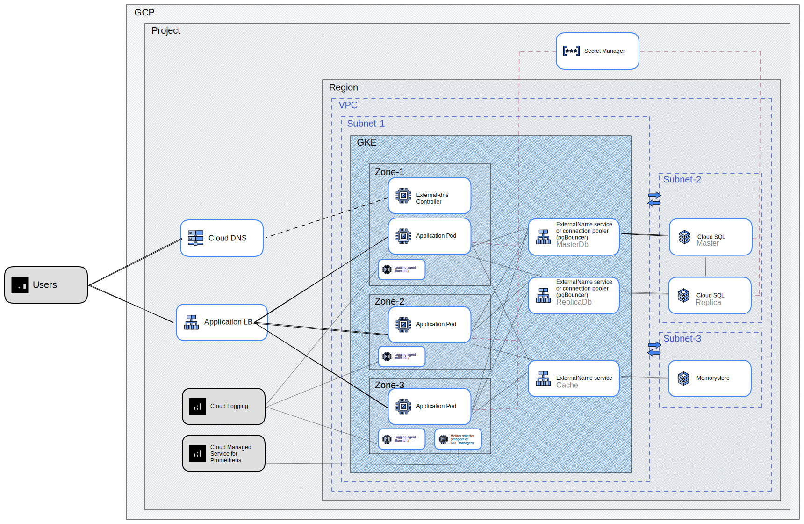

# Hello birthday app

## Description
This is a simple application that returns a greeting message with the number of days until the birthday of the person whose name is passed as a parameter.
It uses `PostgreSQL` as a database to store the birthday dates.

## Project structure
```
/app  - application code
/local - minikube deployment
/gcp - gcp deployment
```

## How to run
### Modify configuration
#### Common parameters
Defined in `common.env`
```
DB_SVC_NAME - name for the Service heading to the database instance (GCP deploy only)
DB_NAMESPACE - namespace for the Service heading to the database instance (GCP deploy only)
DB_NAME - database name
DB_USERNAME - database username
DB_PASSWORD - database password
NAMESPACE - namespace for the application
IMAGE_TAG - tag for the application and migration image
```
#### GCP deploy parameters
Defined in `gcp.env`
```
GOOGLE_PROJECT_ID - GCP project id
GOOGLE_REGION - GCP region
DNS_ZONE - DNS zone for the application external access
```

### Go application unit tests
#### Pre-requisites
* go 1.20
#### Run
```
make app-test
```

### Local environment with docker-compose
#### Pre-requisites
* docker
* docker-compose
#### Run
```
make docker-up
```
#### Stop
```
make docker-down
```

### Local environment with minikube
#### Pre-requisites
* minikube
* docker
* kubectl
* envsubst
* kustomize
#### Run
```
make minikube-up
```
#### Stop
```
make minikube-down
```

### Minikube environment functional tests
#### Pre-requisites
* Running application in minikube environment
* OSX (simple test script uses `date` that is not compatible with GNU `date`)
* curl
* kubectl
#### Run
```
make minikube-test
```

### GCP environment provisioning
#### Pre-requisites
* gcloud (authorized with a project)
* terraform
#### Run
```
make gcp-up
```
#### Post-provisioning
* Add NS records to the domain with ns servers from the output of the previous command for defined zone

#### Stop
```
make gcp-down
```

### GCP environment application deploy/update
#### Pre-requisites
* gcloud (authorized with a project)
* kubectl
* envsubst
* kustomize
#### Run
```
make gcp-deploy
```

## GCP system diagram (minimal dev environment)


## Future improvements
* Setup in-cluster metrics collector (e.g. vmagent or gke managed) and send app metrics (supported by application) to Cloud Managed Service for Prometheus (or any other metrics solution)
* Setup in-cluster logging collector (e.g. fluentbit) and send app logs to Cloud Logging (or any other logging solution)
* Depending on the requirements and application usage patterns, it might be worth to consider using a cache layer (e.g. in-cluster or Memorystore Redis) to reduce the number of database queries
* Another performance related improvement could be to use additional read-only replicas of the database to reduce the load on the master instance
* Use GitOps approach to deploy the application to the cluster (e.g. ArgoCD)
* Use Secret Manager to store database password. Inject it to the application using init container with tools like [secret-init](https://github.com/doitintl/secrets-init)
* Enable TLS for database connection or use Cloud SQL Proxy
* (*) Use in-cluster ingress controller (e.g. Istio Ingress Gateway or Nginx Ingress Controller) behind Cloud Load Balancer to expose the application to the internet to increase flexibility (limited functionality of GCE Ingress) and pace of development (GCE ingress takes too long to provision ingress changes) 

## Full GCP system diagram


## Demo
Demo is available at [http://birthday-app.rdemo.wvw.icu/hello/admin](http://birthday-app.rdemo.wvw.icu/hello/admin)